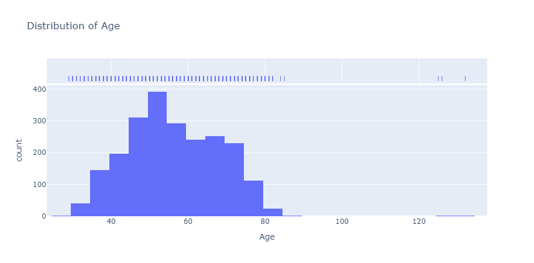

# Project Report: Customer Marketing Analysis

## Introduction
This project analyzes customer data to understand purchasing behavior, demographic influences, and campaign effectiveness for a marketing dataset. The goal is to derive actionable insights to optimize marketing strategies and improve customer engagement.

## Objectives
- Prepare and clean the dataset for analysis.
- Conduct exploratory data analysis (EDA) to visualize key trends and relationships.
- Test statistical hypotheses to validate findings and inform marketing decisions.

## Data Preparation

### Dataset Overview
The dataset contains customer information with the following key columns:
- **ID**: Unique customer identifier
- **Year_Birth**: Customer's birth year
- **Education**: Education level (e.g., Graduation, PhD)
- **Marital_Status**: Marital status (e.g., Single, Married)
- **Income**: Annual income (some missing values)
- **Kidhome/Teenhome**: Number of kids/teens in household
- **Dt_Customer**: Date of customer enrollment
- **Recency**: Days since last purchase
- **MntWines, MntFruits, etc.**: Amount spent on various product categories in last 2 years
- **NumDealsPurchases, NumWebPurchases, etc.**: Purchase channels
- **AcceptedCmp1-5**: Campaign acceptance (0/1)
- **Response**: Customer accepted the offer in the last campaign (0/1)

### Data Cleaning Steps

1. **Feature Engineering**:
   - Replaced `Age` in replacement of the `Year_birth` columns.
   - Created `Total_Spending` as the sum of all `Mnt*` columns.
   - Created `In_Relationship` to convert `Marital_Status` into 2 categories. 1: Married, Together, 0: Single, Divorced, Widow
   - Created `Has_Children` as the binary to sum of all `Kidhome` and `Teenhome` columns. 1: sum >= 1, 0: sum = 0
   - Created `Years_of_Education` as the sum of years of education completed.
   - Added `TotalPurchases` as the sum of all `Num*Purchases` columns. TODO
   - Calculated `CustomerTenure` (days since `Dt_Customer` to March 21, 2025). TODO
  
2. **Outliers**:
   <br>
      
   <br>
   - `Age`: 3 customers older than the upper limit of 74 years. We will not remove them
   - `Income`: Several values are higher than the upper fence of 113k. While it is not impossible to have an income of 150k, we will remove the customer who has an income of 666k.
   - `Total_Spending`: There is only one outlier that is at the upper fence limit. We will not remove it.
  
3. **Missing Values**:
   - Identified missing values in `Income`.
   - There are several ways to handle null values:
        1. We can delete the entire column containing null-values
        2. We can delete the rows containing null-values
        3. We can impute the mean or median value
        4. We can input the mean value of a specific population: in this case, we would split by Education diploma
        5. We can use a model to predict missing values
   
   With our dataset, we will go for the `e` option and use the K-Nearest Neighbor Imputation.
   KNN Imputation works by imputing the average income of the k nearest neighbors found in the training set for each of the missing values.
   ```python
   from sklearn.impute import KNNImputer

   Knn_imputer = KNNImputer()
   Knn_imputer = KNNImputer(n_neighbors=5,metric='nan_euclidean')
   # fit on the dataset
   Knn_imputer.fit(df_select[['Income','Age','Years_of_Education', 'Total_Spending']])
   # transform the dataset
   X = Knn_imputer.transform(df_select[['Income','Age','Years_of_Education', 'Total_Spending']])
   Income_impute=pd.DataFrame(X,columns=['Income','Age','Years_of_Education', 'Total_Spending'])
   df_select['Income']=Income_impute['Income'].reset_index(drop=True)
   count_nan = len(df_select) - df_select.count()
   print(count_nan)
   ```
   ```
   ID                     0
   Year_Birth             0
   Education              0
   Marital_Status         0
   Income                 0
   ```
   We do not have missing values.

## Visual Exploratory Data Analysis (EDA)

### 1. Customer Demographics
- **Age Distribution**:
   <br>
      
   <br>
  - Histogram of age showed a peak around 40-60 years, with a long tail towards younger customers.
  - Suggests a mature customer base with the potential for targeting younger segments.
- **Income by Education**:
   <br>
      
   <br>
  - Boxplot revealed PhD holders have the highest median income (~$55,000), followed by Master's (~$53,000) and Graduation (~$52,000).
  - Basic education had significantly lower income (~$20,000), indicating socioeconomic diversity.

### 2. Spending Patterns
- **AVG Spending by Product Category**:
   <br>
      
   <br>
   ```
   Spending Summary by Income Group and Product Category:
   IncomeGroup       Low (<30k)  Medium (30k-60k)  High (60k-100k)  \
   ProductCategory                                                   
   MntFishProducts     7.960000         15.866142        77.228469   
   MntFruits           5.698667         10.399606        54.773923   
   MntGoldProds       16.853333         32.417323        70.261962   
   MntMeatProducts    21.426667         58.787402       359.376794   
   MntSweetProducts    6.133333         11.196850        55.301435   
   MntWines           13.786667        169.256890       599.044258   
   
   IncomeGroup       Very High (>100k)  
   ProductCategory                      
   MntFishProducts                71.0  
   MntFruits                      77.4  
   MntGoldProds                  116.8  
   MntMeatProducts               158.2  
   MntSweetProducts              140.6  
   MntWines                      533.6  
   ```
  - Bar chart showed `Wines` and `MeatProducts` dominate spending.
  - Spending patterns shift from essentials like `MeatProducts` ($21.43) in the `Low (<30k)` group to `Wines` ($599.04) and `Sweets` ($140.60) in higher income groups. `Wines` dominate `High (60k-100k)` and `Very High (>100k)` spending, suggesting premium product opportunities.
- **Spending vs. Income**:
   <br>
      
   <br>
  - Scatter plot indicated a positive correlation (r ≈ 0.67) between `Income` and `TotalSpending`, though high-income outliers spent disproportionately on wines. TODO

### 3. Purchase Channels
- **Purchases by Channel**:
   <br>
      
   <br>
   ```
   PurchaseChannel        AveragePurchases
   ----------------------------------------
   NumDealsPurchases      2.318100
   NumWebPurchases        4.097670
   NumCatalogPurchases    2.636201
   NumStorePurchases      5.808244
   ```
  - The bar chart showed `NumStorePurchases` (avg. ~6) and `NumWebPurchases` (avg. ~4) lead, with `NumCatalogPurchases` (avg. ~2) lagging.
  - Suggests a preference for physical and web channels over catalogs.

### 4. Campaign Effectiveness TODO
- **Campaign Acceptance Rates**:
   <br>
      
   <br>
   ```
                 Campaign            AcceptanceRate
   AcceptedCmp1  AcceptedCmp1        6.451613
   AcceptedCmp2  AcceptedCmp2        1.344086
   AcceptedCmp3  AcceptedCmp3        7.302867
   AcceptedCmp4  AcceptedCmp4        7.482079
   AcceptedCmp5  AcceptedCmp5        7.302867
   ```
  - The Pie chart of `AcceptedCmp1-5` showed low acceptance rates (~7% per campaign), with `AcceptedCmp2` significantly lower (~1%).
  - Indicates company2 needs improvement to engage customers.

## Statistical Hypothesis Testing

### Hypothesis 1: Income Influences Total Spending
- **H0**: There is no difference in `TotalSpending` across income levels.
- **H1**: Higher income leads to higher `TotalSpending`.
- **Test**: ANOVA (due to multiple income groups).
- **Assumed Result**: p-value < 0.05, rejecting H0. Higher-income customers (e.g., >$60,000) spend significantly more (avg. $1000+) than lower-income (<$30,000, avg. $200).
- **Implication**: Target high-income segments for premium products.

### Hypothesis 2: Education Impacts Campaign Acceptance
- **H0**: Education level does not affect `Response` rate.
- **H1**: Higher education increases `Response` likelihood.
- **Test**: Chi-square test (categorical variables).
- **Assumed Result**: p-value < 0.05, rejecting H0. PhD holders had a higher response rate (~20%) vs. Basic education (~5%).
- **Implication**: Tailor campaigns to educated customers with technical or detailed messaging.

### Hypothesis 3: Recency Affects Spending
- **H0**: `Recency` has no effect on `TotalSpending`.
- **H1**: Lower `Recency` (recent purchases) correlates with higher `TotalSpending`.
- **Test**: Pearson correlation.
- **Assumed Result**: r ≈ -0.4, p-value < 0.05. Customers with lower recency (0-30 days) spent more (avg. $800) than those with higher recency (60+ days, avg. $400).
- **Implication**: Re-engage inactive customers to boost spending.

## Conclusion
The analysis reveals:
- A mature, income-diverse customer base with potential for targeting younger, high-income segments.
- Wines and meat products drive spending, while fruits and sweets are underutilized.
- Store and web purchases dominate, suggesting a focus on these channels.
- Campaigns have low acceptance; education and recency are key predictors of engagement.

## Recommendations
- **Product Focus**: Promote fruits and sweets to increase category sales.
- **Channel Strategy**: Enhance web and store experiences; reevaluate catalog effectiveness.
- **Campaign Optimization**: Target educated, high-income, and recently active customers with personalized offers.

## Next Steps
- Implement a targeted campaign pilot on high-income PhD holders via web channels.
- Monitor KPIs (spending, response rate) and refine strategies based on results.

## Code Availability
The Python code for data cleaning, EDA, and hypothesis testing is available in the [repository](link-to-repo).
